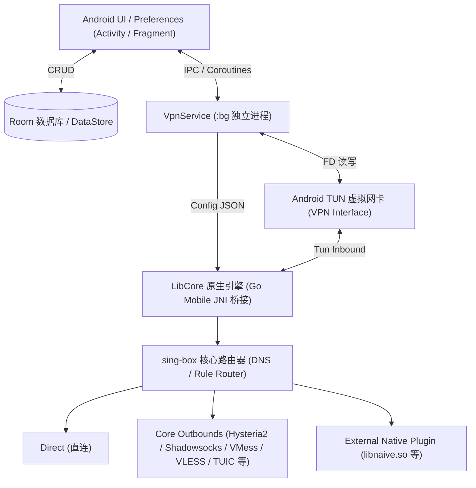

# ThBox 项目技术与评估文档

本目录收录 ThBox for Android 项目的核心技术评估、升级路线、架构拓扑与关键问题排查文档。

## 目录索引

| 文档 | 类型 | 说明 |
|---|---|---|
| [**系统与代码架构优化评估报告**](./code-architecture-and-build-optimization-assessment.md) | 架构评估 | 深度评估 JVM 编译目标、CI/CD 提速策略、LibCore 缓存机制与第三方技术债解耦方案 |
| [**常见问题与排查指南 (FAQ)**](./troubleshooting-faq.md) | 运维支持 | 汇集证书覆盖安装、FakeDNS/DoH 搭配选择、国产安卓系统后台保活与规则导入指引 |
| [**sing-box 最新稳定版（v1.14.0）升级与项目优化改进评估**](./singbox-latest-upgrade-and-optimization-assessment-2026-09.md) | 核心评估 | 详细评估 sing-box 1.14.0 新特性、破坏性变更、以及 ThBox 分流规则、DNS 缓存、插件架构与系统性改进路线 |
| [**Material 3（1.12.0+）适配与 UI 美化评估**](./material-3-ui-adaptation-evaluation.md) | UI 设计 | 评估迁移至 Material 3 (1.12.0+)、Dynamic Colors 动态取色、Edge-to-Edge 全屏沉浸与现代控件升级方案 |
| [**Shadowrocket 高级规则集在 ThBox 中的可行性分析**](./shadowrocket-advanced-rules-feasibility.md) | 规则体系 | 深入剖析外部复杂规则（如 Shadowrocket 规则）在 sing-box / ThBox 中的兼容性、边界与落地模式 |
| [**Android 安装包签名与证书冲突排查说明**](./android-package-signature-install-conflict.md) | 构建与签名 | 详细解析覆盖安装时“证书不一致”的根本成因、包名共存机制与固定 release.keystore 解决方案 |

---

## 核心架构与数据流拓扑

