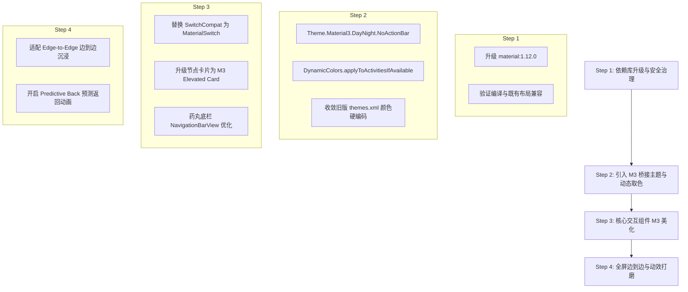

# Material 3（1.12.0+）适配与 UI 美化评估报告

> **评估日期**：2026-09-03  
> **项目基线**：ThBox for Android (`io.github.rainsmen.thbox`)  
> **当前依赖**：`com.google.android.material:material:1.8.0`，主题继承 `Theme.MaterialComponents.DayNight.NoActionBar` (Material 2)  
> **目标基线**：`com.google.android.material:material:1.12.0` (Material 3)，全面支持 Material You 动态配色、沉浸式边到边与现代 Android 15 交互规范。

---

## 0. 摘要与核心价值

当前 ThBox 的 UI 框架仍沿用早期 SagerNet / NekoBox 的 **Material 2 (MDC 1.8.0)** 规范：
1. **视觉过时**：硬编码了大量 Android 5.0~8.0 时代的 Material 2 静态色彩（如 `@color/material_light_blue_500`、`colorPrimaryDark`），缺乏现代感；
2. **缺乏动态取色**：无法跟随 Android 12+（API 31+）用户的壁纸系统主题（Material You / Dynamic Colors）；
3. **未适配边到边规范**：Android 15（Target SDK 35）全面强制启用全屏沉浸（Edge-to-Edge），现有布局在全面屏手势导航栏处存在黑底与状态栏遮挡隐患；
4. **组件落后**：仍在使用已被官方淘汰或降级的 `SwitchCompat`、M2 方角卡片和旧版底部导航。

升级至 **Material 3 (1.12.0+)** 并推进 UI 美化，将使 ThBox 的界面质感、动效流畅度和现代系统集成度达到主流 Android 标杆水平。

---

## 一、Material 3（1.12.0+）核心收益剖析

### 1. 动态取色引擎（Dynamic Colors / Material You）
- **原理**：基于 Android 12+ 的 Monet 色彩算法，从用户壁纸中智能提取主色调、次色调、表面色（Surface）和表面强调色（Surface Container）。
- **应用落地**：
  在 `Application.onCreate()` 中仅需一行调用：
  ```kotlin
  DynamicColors.applyToActivitiesIfAvailable(this)
  ```
  在支持的系统上，应用界面按钮、开关、卡片、选中项会自动融入系统整体色调；对于不支持动态取色的低版本系统（Android 10/11），则自动回退到优雅的品牌预设配色。

### 2. 现代控件生态与视觉重塑

| 控件类型 | 现状（Material 2） | Material 3 现代化重构 | 视觉提升 |
|---|---|---|---|
| **开关组件 (Switch)** | 细轨、方圆滑块的旧版 `SwitchCompat` | `com.google.android.material.materialswitch.MaterialSwitch` | 宽轨药丸造型，滑动自带缩放形变，支持开关内嵌图标（选中勾选/未选中横线），手感与辨识度极佳。 |
| **节点卡片 (Cards)** | 单一阴影的 `MaterialCardView` | M3 提供 `Elevated`、`Filled`、`Outlined` 三种变体 | 支持 Surface Tint 表面着色，卡片层级感更强，深色模式下通过色调而不是刺眼的投影表达层级。 |
| **底部导航栏 (BottomNav)** | 传统图标+文字单色高亮 | M3 `NavigationBarView` 药丸形指示背景（Pill indicator） | 选中项具有柔和的胶囊指示器与平滑平移动画，与现代原生系统底栏完全对齐。 |
| **搜索框 (Search)** | 弹窗或传统输入框 | `SearchBar` + `SearchView` 展开联动 | 沉浸式搜索栏，支持点击平滑全屏展开与历史搜索流动布局。 |
| **对话框 (Dialogs)** | 直角偏硬的 `AlertDialog` | `MaterialAlertDialogBuilder` 带 28dp 大圆角与 Surface Container 填充 | 整体观感柔和温润，层次分明。 |

### 3. Android 15 (Target SDK 35) 沉浸式边到边（Edge-to-Edge）
- **要求**：Android 15 将强行对所有应用应用 `edgeToEdge` 布局，应用必须自行处理 `WindowInsets`，否则会被状态栏或手势横条遮挡。
- **M3 优势**：Material 3 库在 1.12.0+ 深度整合了 `WindowInsetsCompat` 与 `ViewCompat.setOnApplyWindowInsetsListener`，可以配合 `fitsSystemWindows` 无缝处理状态栏与手势横条的内边距，呈现真正的无界沉浸设计。

### 4. 预测性返回动画（Predictive Back Gesture）
- **特性**：M3 1.12.0 原生支持 Android 14/15 的预测性返回动画。在返回桌面或退出层级页面时，界面会随手指滑动呈现平滑的交叉渐变和卡片缩小动效，极大增强系统操作丝滑度。

---

## 二、当前代码库现状与改造难点评估

审查 [`app/src/main/res/values/themes.xml`](file:///home/rainan/projects/nekobox/app/src/main/res/values/themes.xml) 发现以下耦合点：

### 1. 深度耦合的 Material 2 属性命名
当前主题大量依赖 M2 私有属性：
```xml
<item name="colorPrimaryDark">@color/material_light_blue_700</item>
<item name="colorAccent">@color/material_light_blue_accent_200</item>
<item name="colorButtonNormal">?colorAccent</item>
<item name="tabTextColor">#99FFFFFF</item>
```
而在 Material 3 中，色彩体系全面迁移为：
- `colorPrimary` / `colorOnPrimary` / `colorPrimaryContainer` / `colorOnPrimaryContainer`
- `colorSecondary` / `colorOnSecondary` / `colorSecondaryContainer`
- `colorSurface` / `colorOnSurface` / `colorSurfaceVariant` / `colorOnSurfaceVariant`
- `colorOutline` / `colorOutlineVariant`

### 2. 存在几十套静态硬编码色板
`themes.xml` 中手写了数十个包含固定十六进制数值的 `Theme.SagerNet.Blue`, `Green`, `Purple`, `Red` 等颜色主题变体。迁移时需要将这批主题收敛为符合 M3 Color Role 规范的配色集，或者引导用户使用更具科技感的系统动态取色。

### 3. Preference 页面样式兼容
由于设置界面依赖 `androidx.preference:preference-ktx` 与 `preferencex` 自定义组件，M3 迁移需要确保各个配置页面的 Switch、EditText 和 ListPreference 能够正确映射 M3 样式。

---

## 三、推荐的四步走实施路线



### 第一阶段：依赖升级与轻量桥接（已就绪）
1. 将 `app/build.gradle.kts` 中的 `com.google.android.material:material` 升级到 `1.12.0`。
2. 保持现有的 `Theme.MaterialComponents` 正常编译运行，消灭版本过低带来的构建与安全警告。

### 第二阶段：启用 Dynamic Colors 与基类改造
1. 在核心入口注入 `DynamicColors.applyToActivitiesIfAvailable(this)`；
2. 逐步引入 `Theme.Material3.DayNight.NoActionBar` 作为主应用基类主题；
3. 保留一套精美默认的 M3 科技蓝调配色（Seed Color: `#0061A4`），在低版本 Android 设备上呈现标准 M3 质感。

### 第三阶段：核心视图组件美化
1. **主界面节点列表**：
   - 节点卡片采用 16dp 大圆角、Surface Container 背景色与轻微边框（Outlined / Elevated）；
   - 选中节点使用 `colorSecondaryContainer` 高亮背景，右侧状态指示采用彩色状态微标（Badges）；
   - 测速延迟数字按区间着色（绿色 < 100ms，橙色 < 300ms，红色高延迟）。
2. **连接控制大按钮**：
   - FAB 或居中连接开关升级为具有扩散微动效（Ripple + Scale）的 Material 3 悬浮形态。
3. **设置界面 Switch 升级**：
   - 全面使用带图标状态的 `MaterialSwitch`，提升开关滑动时的交互反馈。

### 第四阶段：边到边沉浸与动效升级
1. 调用 `enableEdgeToEdge()`，确保状态栏和底部导航栏完全透明，内容自然延伸至屏幕顶底两端；
2. 为 Android 14+ 开启 `android:enableOnBackInvokedCallback="true"`，获得原生的预测性返回手势卡片缩放动效。

---

## 四、结论与收益展望

适配 Material 3（1.12.0+）不仅是视觉层面的“换皮”，更是将 ThBox 推向现代化 Android 标杆应用的必经之路：
- **一致性**：与 Android 12~15 原生桌面及现代顶级应用拥有统一的设计语言；
- **流畅性**：原生获得高级渲染过渡动效与触控波纹反馈；
- **合规性**：提前解决 Android 15 强制 Edge-to-Edge 带来的兼容性危机。
